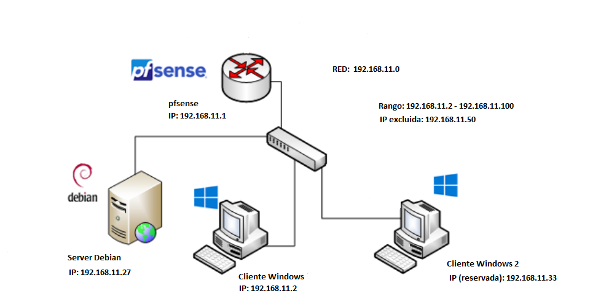
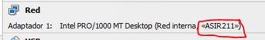
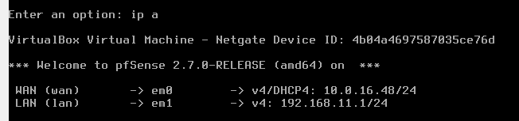
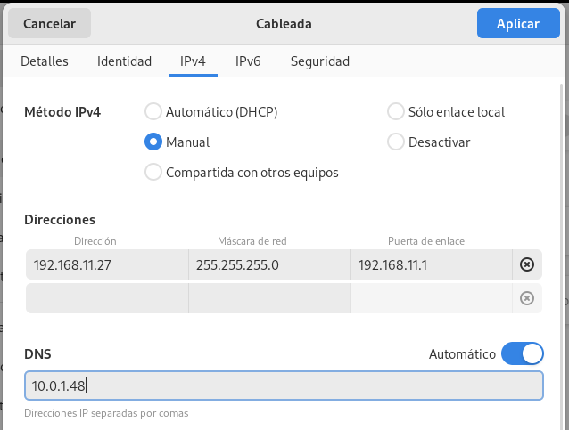
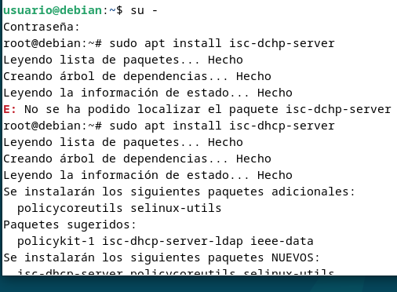
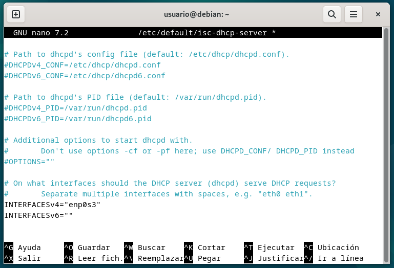
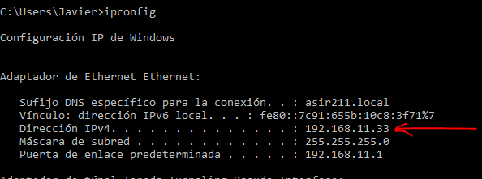
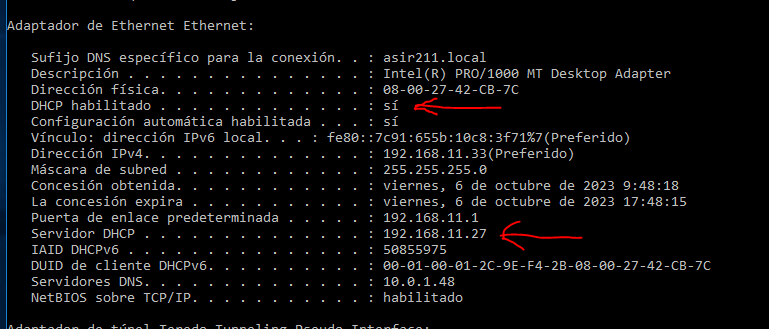
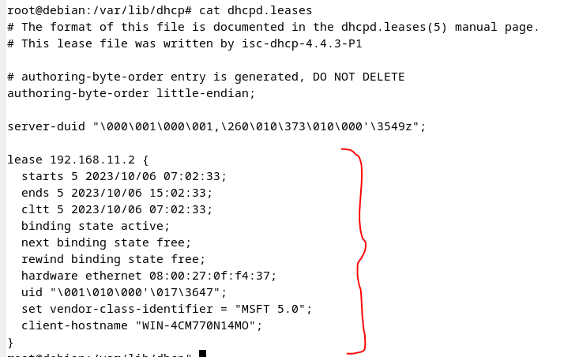

# INDICE

[ESQUEMA RED](#esquema)  
[PASO 1: Tarjeta Red](#paso-1)  
[PASO 2: IP pfSense/Debian](#paso-2)  
[PASO 3: Instalar DCHP](#paso-3)  
[PASO 4: Fichero tarjeta red](#paso-4)  
[PASO 5: FIchero parametros](#paso-5)  
[PASO 6: Estado Debian](#paso-6)  
[PASO 7: Clientes](#paso-7)  
[PASO 8: Revisar](#paso-8)  
<br></br>

# INTRODUCCION
### Esta actividad consiste en una guia mediante un ejemplo en el que se describan los ficheros involucrados y los comandos necesarios para **configurar el servidor isc-dhcp server en Debian, junto con la unión de dos clientes.**
<br></br>

# Esquema

<br></br>

# PASO 1
### Poner todas las máquinas con las que vas trabajar en la misma red, en este caso la red sera ASIR211.

<br></br>

# PASO 2
### Configurar la ip estática de forma manual en pfSense (192.168.11.1) y en Debian (192.168.11.27).


<br></br>

# PASO 3
### Instalar DCHP mediante el paquete isc-dhcp-server, usando el comando ```sudo apt```.

<br></br>

# PASO 4
### Hacer una copia de seguridad y editar el fichero isc-dhcp-server para poner la tarjeta de red adecuada, siendo en este caso la tarjeta enp0s3. 


<br></br>

# PASO 5
### Hacer una copia de seguridad del fichero dhcpd.conf y editarlo para poner todos los rasgos (red, mascara, rango, dns, nombre del dominio, puerta de enlace y lease-time) ademas de hacer la reserva de un ip (192.168.11.33). A diferencia de otros sistemas operativos, para excluir una ip simplemente la evitamos en el rango, como hacemos en el ejemplo con la 192.168.11.50.


<br></br>

# PASO 6
### Ver el estado del servidor, que en este momento esta apagado y arrancarle para seguir trabajando mediante los comandos ```systemctl (status, stop, start) isc-dhcp-server```.

<br></br>

# PASO 7
### Conectar los clientes, Windows/Ubuntu y revisar que la ip dada de forma automatica es correcta, tanto la reservada como la estandar.
### **IP Estandar:**


### **IP Reservada:**


<br></br>

# PASO 8
### Por ultimo, revisar el fichero dhcpd.leases para ver que ha quedado registro de los datos del cliente (en este fichero no se ven los datos del cliente con la ip reservada).
